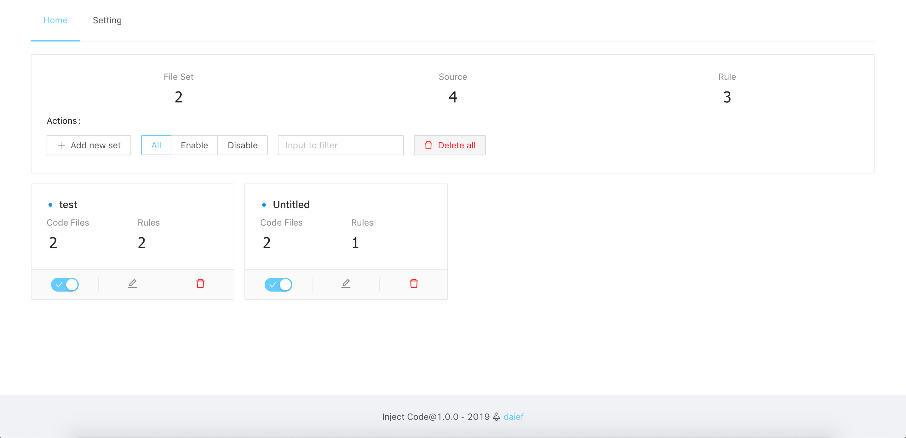
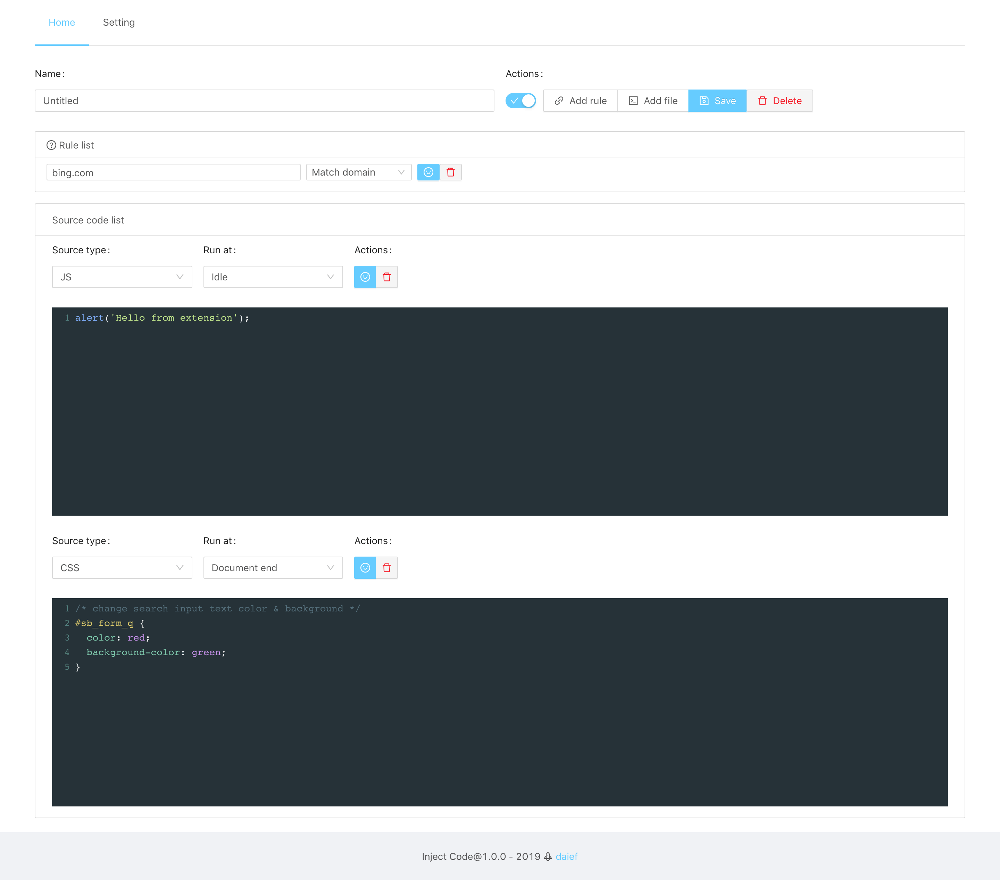
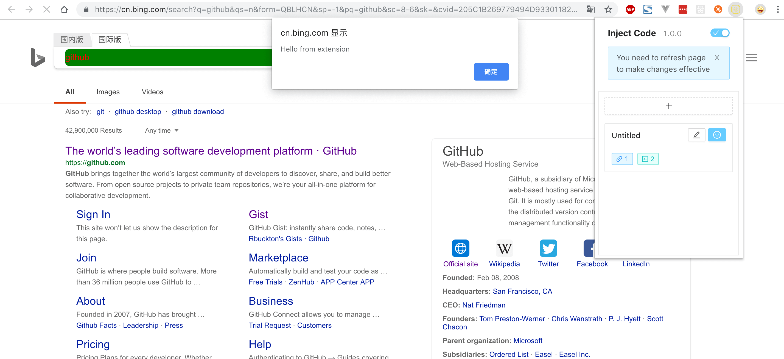

## Inject Code

**Inject Code** is a chrome extension. It can help to inject your custom code to pages while supporting JS and CSS.

This is a personal project . The purpose of this project is to learn how to write chrome extension using TypeScript, Webpack.

## Development

```bash
# Install dependencies
$ yarn

# Watch and compile
$ yarn dev

```

Then load the extension from 'dist/'.

## Build

```bash
$ yarn build

```

## Notice

The injected code is running at another vm, but you can still do the most of things.

And there is an object can use directly called InjectCode. Here is the definition of it.

```ts
interface Window {
  InjectCode: {
    // the api is same as the axios
    // with this no CORS
    axiosGet: AxiosStatic['get'];
    axiosPost: AxiosStatic['post'];
    axiosGetUri: AxiosStatic['getUri'];
    axios<T = any>(config: AxiosRequestConfig): AxiosPromise<T>;
    axios<T = any>(url: string, config?: AxiosRequestConfig): AxiosPromise<T>;

    injectJS(code: string): void;
  };
}
```

## Preview






